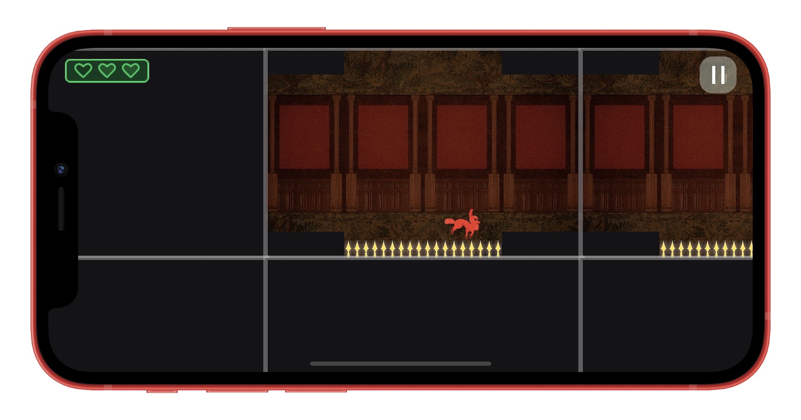

# Malperdy (iOS) 
Made by Cornell University CS/INFO 4152/5152 Team 6 **Humblegends**, Spring 2022.

Take on the role of Reynard the fox as he outruns the enemies of his past to reclaim his home! In this unique twist on a puzzle platformer, swap rooms and avoid traps as you traverse the castle Malperdy. 

Made by Evan Azari, Lucas Cusati, Hanya Gao, Kristina Gu, Lulin He, Spencer Hurst, Abu Qader, Jordan Selin, and Barry Wang in Ithaca, NY.
Made with [Cornell University Graphic Library](https://www.cs.cornell.edu/courses/cs5152/2022sp/resources/engine/).

